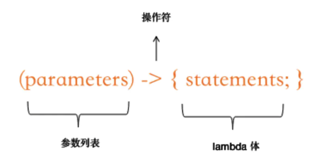

# 【三】Lambda表达式

### 概述

* Lambda表达式在其它语言中也称为箭头函数、匿名函数、闭包等；
* Lambda表达式体现的是轻量级函数式编程思想；
* `->`符号是Lambda表达式核心操作符，符号左侧是**操作参数**，符号右侧是**操作表达式**；
* Lambda表达式不是解决未知问题的新技术；
* Lambda表达式是对现有解决方法的语义优化；

在Lambda表达式中，也只能操作一个方法，所以它的核心就是一个**函数式接口**实现。

如之前的函数式接口中，我们是通过匿名类实现，现在我们可以通过Lambda表达式来优化：

```java
//参数判断是否等于123
Predicate<String> predicate = s -> s.equals("123");

//将参数和123拼接后打印输出
Consumer<String> consumer = s -> System.out.println(s + "123");

//通过参数num乘以100后，转换为字符串
Function<Integer, String> function = num -> (num * 100) + "";

//通过UUID创建字符串的工厂
Supplier<String> supplier = () -> UUID.randomUUID().toString();

//传入字符串s，返回一个字符串
UnaryOperator<String> operator = s -> s + "hello";

//传入两个整数，返回一个整数
BinaryOperator<Integer> binaryOperator = (num1, num2) -> num1 * num2;
```

### Lambda语法



#### 基本语法

1. **声明**：Lambda绑定的接口类型；
2. **参数**：包含在一对圆括号中，和绑定接口中的抽象方法参数个数及顺序一致；
3. **操作符**：`->`；
4. **执行代码块**：包含在一对大括号中，出现在操作符号右侧；

如：`[接口声明] = （参数） -> {代码执行块}`

#### 无参无返回值Lambda

```java
interface Lambda1{
    void test();
}

//调用
Lambda1 lambda1 = () -> {
    System.out.println("No param");
    System.out.println("No result");
};
lambda1.test();
```

**当`执行代码块`只有一行代码时，可省略`大括号`**：

```java
//调用
Lambda1 lambda1 = () -> {
    System.out.println("No param,No result");
};
lambda1.test();
```

#### 带参数无返回值Lambda

```java
interface Lambda2 {

    void test(String name, int age);
}

//调用
Lambda2 lambda2 = (String name, int age) -> {
    System.out.println("name is " + name + ",age is " + age);
};
lambda2.test("hello", 11);
```

**参数类型不用明确指定，jvm会根据接口推导出参数类型**：

```java
//调用
Lambda2 lambda2 = (name, age) -> {
    System.out.println("name is " + name + ",age is " + age);
};
lambda2.test("hello", 11);
```

#### 带参数带返回值的Lambda

```java
interface Lambda3 {

    String test(String name, int age);
}

//调用
Lambda3 lambda3 =(name, age) -> {
    String temp = "name is " + name + ",age is " + age;
    return temp;
};
lambda3.test("hello",22);
```

**当执行代码只有一行，并不使用`大括号`的情况下，`return` 可省略**：

```java
//调用
Lambda3 lambda3 =(name, age) -> "name is " + name + ",age is " + age;
lambda3.test("hello",22);
```

#### 语法小结

1. Lambda表达式必须和接口进行绑定；
2. Lambda表达式可以附带0到n个参数，括号中的参数类型可以不用指定，jvm在运行时会自动根据绑定的抽象方法进行推导；
3. Lambda表达式的返回值，如果代码块只有一行，并且没有大括号，不用写`return`关键字，单行代码的执行结果会自动返回；如果添加了大括号或者有多行代码，必须通过`return`关键字返回执行结果；