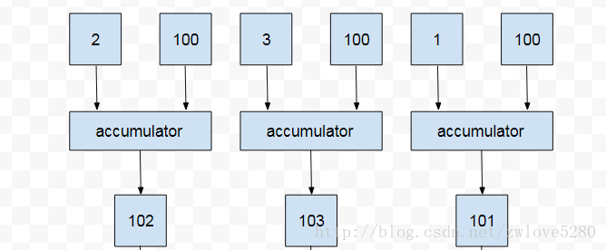
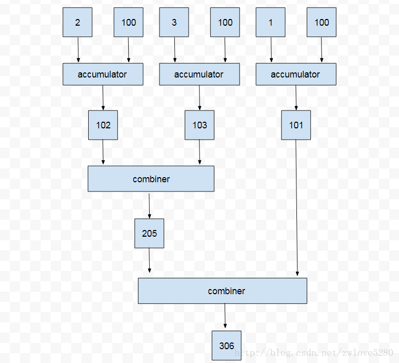

# 【五】Stream

### Stream是什么

> A sequence of elements supporting sequential and parallel aggregate operations.

根据字面意思，Stream是一个支持串行和并行的元素序列。可以理解为它是一个`元素集合`，它和平常的`元素集合`最大的差别在于：

* 普通元素集合中，只能遍历每个元素执行操作；
* Stream是对一串数据进行处理，不需要多次循环遍历操作；

### Stream的特性

- 基于集合或者序列
- 流不存储值，也**不能重复使用**，数据通过管道的方式进行操作
- 每个操作都是函数式的，对流的操作不会影响源数据
- 多数操作（排序，映射，过滤等），可以延迟实现
- 想知道操作符是惰性求值操作符还是及早求值操作符，只需观察其返回值，如果返回值是Stream，则是惰性求值操作符；如果返回值是另一个类型或者是void，则是及早求值操作符。

### Stream语法步骤

对Stream的操作通常有三步：

1. Stream创建;
2. Stream中间操作（Intermediate operations）；
3. Stream终止操作（Terminal operation）；

#### Stream创建

创建Stream有几下几种方式：

* 通过数组创建

  ```java
  int [] source = {1,2,3,4,5,6};
  IntStream s = Arrays.stream(source);
  ```

* 通过集合创建

  ```java
  List list = Arrays.asList(1,2,3,4,5);//Set
  Stream s2 = list.stream();
  ```

* 通过Stream包装流创建

  ```java
  IntStream s3 = IntStream.range(1,10);//LongStream、DoubleStream
  ```

* 通过Stream直接创建

  ```java
  Stream s4 = Stream.of("wo", "ai", "?")
  ```

#### Stream中间操作

* filter

  ```java
  Stream<T> filter(Predicate<? super T> predicate);
  ```

  过滤操作，新生成的Stream只包含符合条件的元素，通过函数式接口Predicate实现。

* map

  ```java
  <R> Stream<R> map(Function<? super T, ? extends R> mapper);
  ```

  转换操作，将T类型转换为R类型，新生成的Stream只包含转换生成的元素，通过函数式接口Function实现。

  更多的封装操作：`mapToInt`、`mapToLong`、`mapToDouble`,会转换为对应的类型。

* flatMap

  ```java
  <R> Stream<R> flatMap(Function<? super T, ? extends Stream<? extends R>> mapper);
  ```

  转换操作，与`map`不同的是，T类型会转换为`Stream<R>`。由于得到的子元素是`Stream<R>`,此时父集合即`Stream<Stream<R>>`，flatMap会把Stream中的元素压缩到父集合中，即`Stream<R>`。

  示例：

  ```java
  Person user1 = new Person().setName("user1").setAge(18).setWhere("GuangDong","ShenZhen");
  Person user2 = new Person().setName("user2").setAge(28).setWhere("HuBei", "WuHan");
  Stream<Person> userStream = Stream.of(user1, user2);
  Stream<String> stringStream = userStream.flatMap(Person::getFromWhere);
     public Stream<String> getFromWhere() {
         return fromWhere.stream();
  }   
  ```

  >Lambda 表达式 Person::getFromWhere 其实是把 Stream< Person> 转换为了 Stream< Stream< String>>，而 flatMap() 最终就把 Stream< Stream< String>> 转换为 Stream< String>。

  更多的封装操作：`flatMapToInt`、`flatMapToLong`、`flatMapToDouble`,会转换为对应的类型。

* distinct

  ```java
  Stream<T> distinct();
  ```

  去重操作，对于Stream中包含的元素进行去重，新生成的Stream中没有重复的元素；

  **去重逻辑依赖元素的equals方法**。

* sorted

  ```java
  Stream<T> sorted();
  Stream<T> sorted(Comparator<? super T> comparator);
  ```

  排序操作，sorted() 使用的是自然排序，而 sorted(comparator) 需要给定一个排序标准。

* peek

  ```java
  Stream<T> peek(Consumer<? super T> action);
  ```

   peek生成一个包含原Stream的所有元素的新Stream，同时会提供一个消费函数（Consumer实例），当最终用及早求值操作符消费此Stream时，新Stream每个元素都会执行给定的消费函数。

* limIt

  ```java
  Stream<T> limit(long maxSize);
  ```

  对一个Stream进行截断操作，获取其前N个元素，如果原Stream中包含的元素个数小于N，那就获取其所有的元素；

* skip

  ```java
  Stream<T> skip(long n);
  ```

  返回一个丢弃原Stream的前N个元素后剩下元素组成的新Stream，如果原Stream中包含的元素个数小于N，那么返回空Stream；

#### Stream终止操作

Stream是惰性的，只有在终止操作的时候才会进行计算。

>一般来说，除了初始创建流的，**返回流对象的大部分是业务中间操作**，业务中间操作*（intermediate operations）*只会暂是保留，不会执行，只有遇到求值终止操作*（terminal operation）* 时，才会一起执行。

* forEach

  ```java
  void forEach(Consumer<? super T> action);
  ```

  对于并行的流，并不能保证流中元素的顺序，如果保证了顺序就会牺牲掉并行所带来的好处。对于任意一个元素，它的 action 可能会在任意时间，任意线程中执行，这是由库选择的。如果 action 要访问一个共享状态，这个方法需要提供了同步机制。

  ```java
  void forEachOrdered(Consumer<? super T> action);
  ```

  按照 Stream 中元素的顺序执行 action，也就是说同一时间只有一个 action 在进行，但是这个 action 可能在任意线程中执行，这也是由库选择的。

* toArray

  ```java
  Object[] toArray();
  ```

  将Stream转换为数组。

  ```java
  <A> A[] toArray(IntFunction<A[]> generator);
  ```

  将Stream 转换为特定类型的数组，返回的数组的大小与 Stream 中元素个数是一样的。

  IntFunction 函数接口中参数i表示的是 Stream 中元素的个数。

* match

  ```java
  boolean anyMatch(Predicate<? super T> predicate);
  boolean allMatch(Predicate<? super T> predicate);
  boolean noneMatch(Predicate<? super T> predicate);
  ```

  对Stream的判断操作，是否存在匹配。

  对于`Empty Stream`，它们存在区别：

  * anyMatch() ：如果 Stream 是空 (empty) 的，返回 false，并且 predicate 不会执行。
  * allMatch(), noneMatch：如果 Stream 是空 (empty) 的，返回 true，并且 predicate 不会执行。

* find

  ```java
  Optional<T> findFirst();
  ```

   获取 Steam 中第一个元素，如果 Stream 是无序的，这第一个元素就不确定。

  ```java
  Optional<T> findAny();
  ```

  findAny() 就更随意，获取任意一个元素。

  返回结果是`Optional`：

  ```java
  list.stream().findAny().ifPresent(System.out::println);
  ```

* min

  ```java
  Optional<T> min(Comparator<? super T> comparator);
  ```

  获取Stream中的最小值

* max

  ```java
  Optional<T> max(Comparator<? super T> comparator);
  ```

  获取Stream中的最大值

* cout

  ```java
  long count();
  ```

  获取Stream中元素个数

* reduce

  * 第一种

  ```java
  Optional<T> reduce(BinaryOperator<T> accumulator);
  ```

  reduce方法接受一个函数，这个函数有两个参数，第一个参数是上次函数执行的返回值（也称为中间结果），第二个参数是stream中的元素。函数执行的结果会作为下次执行时的第一个参数。

  要注意的是：**第一次执行的时候第一个参数的值是Stream的第一个元素，第二个参数是Stream的第二个元素**。

  ```java
  Stream.of(1,2,3,4,5,6,7,8,9,10).reduce((sum, item) -> {
          System.out.println("sum is -->" + sum);
          return sum + item;
  }).ifPresent(System.out::println);
  ```

  累加1-10，每次的结果会作为下次计算的第一个参数。

  * 第二种

  ```java
  T reduce(T identity, BinaryOperator<T> accumulator);
  ```

  与第一种方法不同的是，它有初始值`identity`，所以不会出现null。

  * 第三种

    ```java
    <U> U reduce(U identity,BiFunction<U, ? super T, U> accumulator,BinaryOperator<U> combiner);
    ```

    combiner 参数是特意为并行 Stream 准备的，如果不是并行 Stream，第三个参数无效。

    非并行执行：

    ```java
    Integer sum = Stream.of(1, 2, 3)
                    .reduce(100,
                            (result, integer) -> {
                                System.out.println("in accumulator, result = "
                                        + result + ", integer = " + integer);
                                return result + integer;
                            },
                     (result1, result2) -> {
                    System.out.println("in combiner, result1 = "
                                        + result1 + ", result2 = " + result2);
                    return result1 + result2;
                });
    System.out.println(sum);
    ```

    执行结果：

    ```shell
    System.out: in accumulator, result = 100, integer = 1
    System.out: in accumulator, result = 101, integer = 2
    System.out: in accumulator, result = 103, integer = 3
    System.out: 106
    ```

    可以看到，第二个 Lambda 表达式并没有执行。

    

    并行执行：

    ```java
     Integer sum = Stream.of(1, 2, 3)
                    .parallel() // 改为并行流
                    .reduce(100,
                            (result, integer) -> {
                                System.out.println("in accumulator, result = "
                                        + result + ", integer = " + integer);
                                return result + integer;
                            },
                            (result1, result2) -> {
                                System.out.println("in combiner, result1 = "
                                        + result1 + ", result2 = " + result2);
                                return result1 + result2;
                            });
    System.out.println(sum);
    ```

    执行结果：

    ```shell
    System.out: in accumulator, result = 100, integer = 2
    System.out: in accumulator, result = 100, integer = 3
    System.out: in accumulator, result = 100, integer = 1
    System.out: in combiner, result1 = 102, result2 = 103
    System.out: in combiner, result1 = 101, result2 = 205
    System.out: 306
    ```

    

     结论：并行 Stream 和 顺序 Stream 的差异结果原因就在于初始值，这里设置为了 100，如果设置为 0，那么结. 果就是相同的。

    也就是说只要初始值并不影响最终结果，那么并行 Stream 和 顺序 Stream 执行结果是相同的，只是效率不同而已。这个结论同样适用于一个参数和两个参数的 reduce() 方法。

* collect

  将Stream转换为集合，如List、Set或Map，以及分组等操作；

  * 转换为List

    ```java
    Stream.of(1, 2, 3).collect(Collectors.toList());
    ```

  * 转换为Set

    ```java
    Stream.of(1, 2, 3).collect(Collectors.toSet());
    ```

  * 转换为Map

    ```java
    Stream.of(user1, user2, user3)
                    .collect(Collectors.toMap(Person::getName, Person::getAge));
    ```

    Map 的 key 值是不能重复的，而如果上面例子中，Person 的 name 有重复的，就会报异常。

  * 转换成值

    Collectors 还有和 Steram 一样求单一值的方法，例如, 最大/小值(maxBy()/minBy()), 计数(counting()),
    求和(summingInt()/summingLong()/summingDouble()), 求平均数(averagingInt()/averagingLong()/averagingDouble)

    ```java
    Optional<Person> min = Stream.of(user1, user2).collect(Collectors.minBy(Comparator.comparing(Person::getAge)));
    Double average = Stream.of(user1, user2).collect(Collectors.averagingInt(Person::getAge));
    ```

  * 数据分组

    ```java
     Map<Integer, List<Person>> group = Stream.of(user1, user2)
                    .collect(Collectors.groupingBy(Person::getAge));
    ```

    例子中，以年龄来分组，可以注意到返回值为 Map，key 为 Integer 类型，也就是 Person 的 Age 类型，value 为 List 类型，也就是年龄相同的 Person 的集合。

  * 字符串连接

    ```java
    // abcd
    String str1 = Stream.of("a", "b", "c", "d").collect(Collectors.joining()); 
     // a,b,c,d
    String str2 = Stream.of("a", "b", "c", "d").collect(Collectors.joining(","));
    ```

    