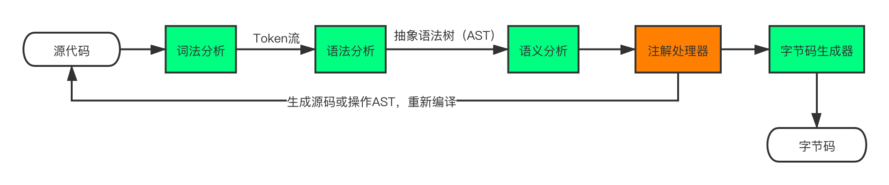

# Java编译流程

### 概述

Java编译是通过`javac`命令将`源文件(.java)`通过编译器转换为`字节码文件(.class)`的过程。编译过程分为“前端编译”和“后端编译”两个阶段。

这里的“前端（Front End）”指的是编译器对程序代码的分析和理解过程。它通常只跟语言的语法有关，跟目标机器无关。而与之对应的“后端（Back End）”则是生成目标代码的过程，跟目标机器有关。

### 前端编译

前端编译主要指与源语言有关但与目标机无关的部分，包括词法分析、语法分析、语义分析与中间代码生成。

主要有以下几步：

* 词法分析

  通过Scanner将源码中所有的单词或字符转换为“词法记号”，即`Token`。就像阅读文章一样，文章是由一个个的中文单词组成，首先要识别每个单词的意思才能读懂文章。

* 语法分析

  在前一阶段生成的`Token流`基础上，以树状结构的形式，识别出程序的语法结构。

  Java中具体通过`TreeMaker`，以`JCTree`的子类为结点构建树结构。该树结构也称为`抽象语法树（Abstract Syntax Tree）`，即`AST`。

  `AST`是一种用来描述程序代码语法结构的树形表示方式，语法树的每一个节点都代表着程序代码中的一个语法结构, 如包、类型、修饰符、运算符、接口、返回值都可以是一个语法结构。

* 语义分析

  语义分析的主要任务是对结构正确的源程序进行上下文有关性质的审查，比如：

  * 某个表达式的计算结果是什么数据类型？如果有数据类型不匹配的情况，是否要做自动转换？

  * 如果在一个代码块的内部和外部有相同名称的变量，我在执行的时候到底用哪个？

  * 在同一个作用域内，不允许有两个名称相同的变量。

* 生成字节码

  在经历了一系列的语义解析之后，所解析出来的语法树就足够完善了。这个时候编译器最后的任务就是调用com.sun.tools.javac.jvm.Gen类，将这棵语法树编译为Java字节码文件。

  这个时候，符合Java规范的**Java代码**就转换成符合Java规范的**字节码文件**了。

