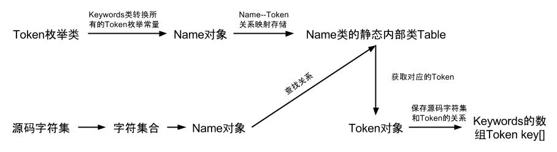
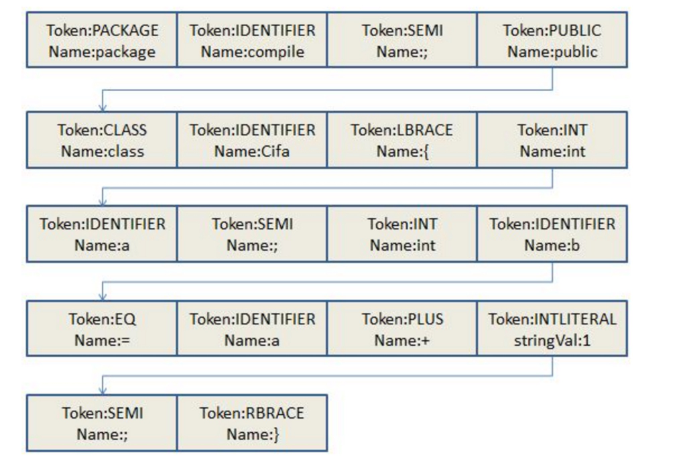

# 【一】词法分析

### 概述

词法分析阶段是编译过程的第一个阶段。这个阶段的任务是从左到右一个字符一个字符地读入源程序，将字符序列转换为规范化的Token序列的过程。Token 是编译过程的最小元素，关键字、变量名、字面量、运算符等都可以成为 Token。在这个过程中，词法分析器还会对标记进行分类。

词法分析器通常不会关心标记之间的关系（属于语法分析的范畴），举例来说：词法分析器能够将括号识别为标记，但并不保证括号是否匹配。

规范化的Token包含：

- java关键词：package、import、public、class、int等
- 自定义单词：包名、类名、变量名、方法名
- 符号：=、;、+、-、*、/、%、{、}等

### 流程

词法分析过程是在的JavacParser.parseCompilationUnit()中完成的：

* com.sun.tools.javac.parser.JavacParser

  规定哪些词符合Java语言规范，具体读取和归类不同词法的操作由scanner完成。

* com.sun.tools.javac.parser.Scanner

  负责逐个读取源代码的单个字符,然后解析符合Java语言规范的Token序列，调用一次nextToken()都构造一个Token。

* com.sun.tools.javac.parser.Tokens$TokenKind、

  里面包含了所有token的类型，譬如BOOLEAN,BREAK,BYTE,CASE。

* com.sun.tools.javac.util.Names　

  用来存储和表示解析后的词法，每个字符集合都会是一个Name对象，所有的对象都存储在Name.Table这个内部类中。

* com.sun.tools.javac.parser.KeyWords　

  负责将字符集合对应到token集合中，如，package com.test.ast; Token.PACKAGE = package， Token.IDENTIFIER = com.test.ast,(这部分又分为读取第一个token,为com，判断下一个token是否为“.”，是的话接着读取下一个Token.IDENTIFIER类型的token，反复直至下一个token不是”.”,也就是说下一个不是Token.IDENIFIER类型的token，Token.SEMI = ；即这个TIDENTIFIER类型的token的Name读完），KeyWords类负责此任务。

### Token序列

Token对应Java中的 com.sun.tools.javac.parser.Token，其中类型字段是一个**枚举类型**，对应`Tokens.TokenKind`，其内部定了许多符合Java语法规范并与**源码字符集**相对应的**枚举常量**。


##### 源码字符集是如何转换成Token的：

Name对象和Token对象建立的是一种一对一的关系。当词法解析器中需要将一个源码字符集合解析成一个Token时，它会通过Names类调用Name类的fromChars()方法获得一个Name对象，然后使用Keyswords类的key(Name name)方法获得传入相对应的Token对象。


##### 词法解析器如何保存源码字符集和Token之间的对应关系：

词法解析器在将源码转字符集合转换为Token之前，会先将每一个字符集合都转换成一个对应的**Name对象**。接着再由com.sun.tools.javac.parser.Keywords类负责实际的Token转换任务（将Token常量全部转换为Name对象），然后转换好的这些Name对象全部存到Name类的**内部类Table**中，Keywords类中的数组key用于保存源码字符集合和Token之间的对应关系。



### 示例

```java
package compile;
public class Cifa {
    int a;
    int c = a + 1;
}
```

以上代码转换为Token流：



### 小结

* 词法分析会将Java源代码按顺序逐一读取，根据`正则文法`和`有限自动机`生成Token序列；
* 每一个Token会与Name一一对应，其中Token的类型根据`Tokens.TokenKind`枚举定义；


参考文献

[编译原理之美](https://time.geekbang.org/column/article/118378)

[词法分析器](https://www.cnblogs.com/wade-luffy/p/5925728.html)

[Java编译过程](https://www.cnblogs.com/straybirds/p/8513870.html)

