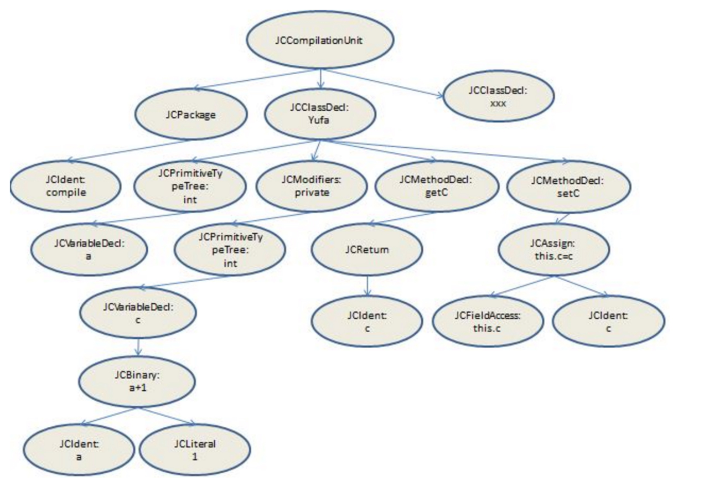
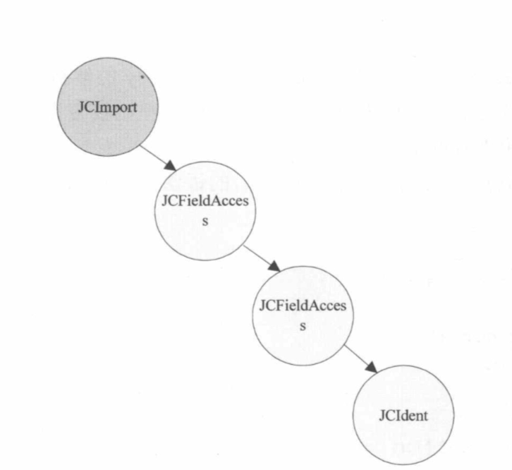
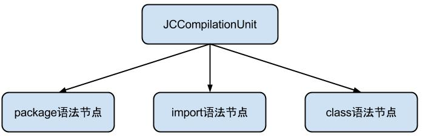

# 【二】语法分析

### 概述

在`词法分析`中生成了Token序列，但它们还不完善，没有被整合起来，`语法分析`的主要任务就是将Token序列中的一个个Token组成一句话。

主要的实现方法是利用`TreeMaker`，以`JCTree`的子类作为语法节点来构建`抽象语法树`。

抽象语法树（Abstract Syntax Tree）是一种用来描述程序代码语法结构的树形表示方式，语法树的每一个节点都代表着程序代码中的一个语法结构, 如包、类型、修饰符、运算符、接口、返回值都可以是一个语法结构。

以抽象的方式来看一个Java源文件，它只有三种基础构建：

* package
* import
* 类（包含class、interface、enum）

### 流程

* com.sun.tools.javac.tree.TreeMaker

  所有语法节点都是由它生成的，根据Name对象构建一个语法节点。

* com.sun.tools.javac.tree.JCTree$xxx

  所有的节点都会继承jctree和实现＊＊tree，譬如 JCIf extends JCTree.JCStatement implements IfTree。

* com.sun.tools.javac.tree.JCTree的三个属性

  * Tree tag:每个语法节点都会以整数的形式表示，下一个节点在上一个节点上加1；
  * pos：也是一个整数，它存储的是这个语法节点在源代码中的起始位置，一个文件的位置是0，而－1表示不存在
  * type：它代表的是这个节点是什么java类型，如int，float，还是string等

### 示例

```java
package compile;
public class Yufa {
    int a;
    private int c = a + 1;
    //getter
    public int getC() {
        return c;
    }
    //setter
    public void setC(int c) {
        this.c = c;
    }
}
```

生成的抽象语法树如下：






**说明**

- 每一个包package下的所有类都会放在一个JCCompilationUnit节点下，在该节点下包含：package语法树（作为pid）、各个类的语法树

- 每一个从JCClassDecl发出的分支都是一个完整的代码块，上述是四个分支，对应我们代码中的两行属性操作语句和两个方法块代码块，这样其实就完成了语法分析器的作用：将一个个Token单词组成了一句句话（或者说成一句句代码块）

- 在上述的语法树部分，对于属性操作部分是完整的，但是对于两个方法块，省略了一些语法节点，例如：方法修饰符public、方法返回类型、方法参数。

  

### AST操作

拿到了抽象语法树，等于我们拿到了整份的代码，我们可以对所有的代码进行扫描，可以在特定的代码中写入一些逻辑：

- 清除或者添加日志；
- 对象调用的非空判断；
- 编写我们特定的语法规则，对不符合规则的代码进行修改或优化；
- 增删改查。。。

### 小结

* 语法分析会基于Token序列生成抽象语法树（AST）；
* AST会以树的方式构建Java源文件，同一个包的类会放到`JCCompilationUnit`下，其中每一个类以`JCClassDecl`来表示；
* 目前为止，只在APT过程中能操作AST，通过`TreeVisitor`和`TreeScanner`扫描语法树，通过`TreeMaker`增删改查AST；
* 上图中的`JCPackage`并不真实存在，只是在JCCompilationUnit多了一层package的标记；
* 语法树结构可通过`Eclipse`的插件`ASTView查看`；


### 参考文献

[JCTree详细说明](https://www.jianshu.com/p/68027eaf45ad)

[ButterKnife操作AST](https://juejin.im/post/5c45bce5f265da612c5e2d3f)

[AST全面解析](https://www.jianshu.com/p/4bd5dc13f35a)

[AST实战](https://www.jianshu.com/p/68fcbc154c2f)

[编译原理](https://time.geekbang.org/column/article/119891)

[修改语法树](https://juejin.im/post/5e7c540ff265da42e16b02fc#heading-33)